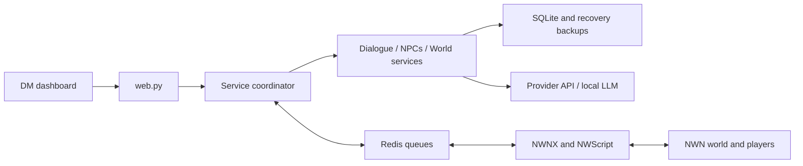

# Architecture

Role Weaver is a companion process with a local HTTP dashboard. NWN remains the game server.
Redis connects Python and NWScript; Python owns authored content and LLM requests, while game
scripts decide whether an action is still valid in the live world.

## Code map

| Area | Entry point | Responsibility |
| --- | --- | --- |
| Composition | `roleweaver/service.py` | Shared state, worker pool, incoming events, outbound commands |
| Dialogue | `roleweaver/services/dialogue.py` | Input/output review, generation, wait feedback, cancellation |
| NPC lifecycle | `roleweaver/services/npcs.py` | Profiles, spawning, persistence, pause/resume, deletion |
| World administration | `roleweaver/services/world.py` | Lore, backups, memory inspection, conversation policy |
| Approved actions | `roleweaver/action_service.py` | Action dispatch and authoritative acknowledgements |
| Rules/data validation | `actions.py`, `authoring.py`, `merchant_admin.py` | Validate owner input and model selections |
| LLM | `provider.py`, `llm_settings.py` | Prompts, structured responses, fallback, credentials |
| Safety | `guardrails.py`, `ai_validation.py`, `safeguards.py` | Core checks, optional validators, review policy |
| Persistence | `store.py`, `backup.py`, `recovery.py` | SQLite, validated restore, scheduled snapshots |
| Observability | `usage.py`, `knowledge.py` | Request metrics and authorized knowledge inspection |
| UI | `web.py`, `static/` | Loopback routes and browser panels |
| Native integration | `bridge/*.nss` | Hearing, targeting, DM authority, transactions and actions |

Paths in this table are relative to `roleweaver/` unless explicitly qualified.

## Shared state and concurrency

The domain classes are mixins, not independent services. They execute on the same `Service` object,
sharing its reentrant lock, store, game state and generation counters. This preserves the existing
API while making each responsibility readable. Do not instantiate a mixin on its own.

The bridge loop processes game events and acknowledgements. A four-worker pool performs dialogue
work. Each request captures settings and game identity under the lock, releases it for network I/O,
and checks state again before emitting a reply. A generation counter invalidates work after profile,
settings or control changes. Session and epoch checks also reject results from an old game instance
or control state. The native bridge repeats the relevant checks before speech/action execution.

## A player exchange

1. NWScript determines the intended nearby NPC and emits a chat event.
2. The service validates session/control state, stores the player's text and admits bounded work.
3. The dialogue service snapshots the NPC's authorized lore, memory and settings.
4. Local checks and optional LLM input review run before generation.
5. The provider creates text or structured speech/action output. Game stock/price snapshots ground
   merchant answers; model output cannot grant inventory or gold directly.
6. Output validation/review runs; stale generations never speak.
7. A `say` command is queued. Only an accepted game acknowledgement stores the NPC reply and
   permits the associated approved action to proceed.

Wait emotes use transient commands and are not stored as memories. They start at five seconds;
`Hmm...` follows ten seconds later and repeats every ten seconds until work completes or is cancelled.

## Provider behavior

Gemini fallback keeps a successfully decoded model preferred until it fails. Preferences and timeout
cooldowns are in memory and reset on process restart. At most three attempts share a request budget.
429/authentication/invalid-format handling differs from busy/timeouts; see the provider tests before
changing retry policy. A successfully decoded response still has to pass downstream validation.

## Persistence and authority boundaries

SQLite stores authored content and conversation state. Private provider settings and the identity salt
are separate files. Application backups do not replace NWN campaign-database backups. Game store
state and item purchases must be backed up and validated on the game side.

The HTTP dashboard is an administrative surface bound to loopback, not a public multiuser service.
Use an SSH tunnel. Never expose it publicly without a separately designed authentication boundary.
